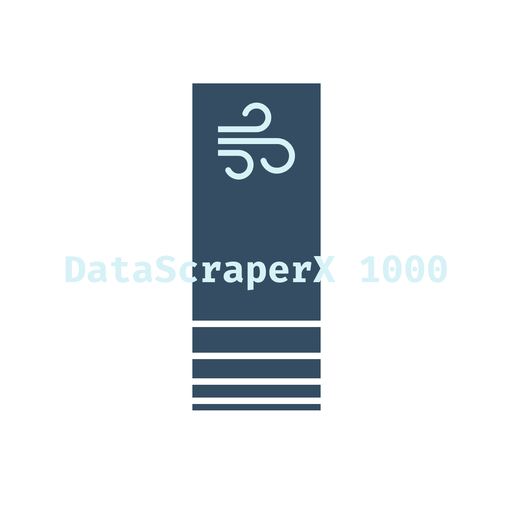

# ⚒️ DataScraperX 1000 😶‍🌫️

> Get data in minutes, not hours! or what ever your internet speed is.

## 🧰 Tech Stack

- [Appwrite](https://appwrite.io/)
- [CreateT3](https://nextjs.org/)
- [TypeScript](https://www.typescriptlang.org/)
- [Chakra UI](https://chakra-ui.com/)
- [jszip](https://stuk.github.io/jszip/)
- [AuthUI](https://www.authui.site/)

## Features 🪄

### Data Storage and Export

Facilities to store scraped data in a structured format such as CSV, JSON, or a database. Additionally, the ability to export the data for further analysis or integration with other systems.

### User-Friendly Interface

Web-based interface allows users to set up scraping tasks, monitor progress, view extracted data, and configure scraping settings easily.

### No-Code Scraper 🔨

No more coding complexities! DataScraperX 1000 allows you to get the data you need without writing a single line of code. Simply select the data you want to scrape, and our tool will do the rest for you. It's that easy!

### Acknowledging the Creator 🙏

Clearly attribute the creation of the data scraping website to the original creator or development team. This is done by adding a link to the original website in the footer of every data that is scraped.

## 🔮 Future Plans

- Nicer delete confirmation modal
- Improve UI
- More providers as well as More Data Types (e.g. Video, Sentiment Analysis, Audio, etc.)
- More caching

## Installation

To get started with DataScraperX 1000, follow these simple steps:

1. Clone the repository:

   ```shell
   git clone https://github.com/AnujSsStw/data_scrap.git
   cd data_scrap
   ```

2. Install the dependencies:

   ```shell
   pnpm install
   ```

3. Start the development server:

   ```shell
   pnpm dev
   ```

4. Open your browser and navigate to `http://localhost:3000` to access DataScraperX 1000.
